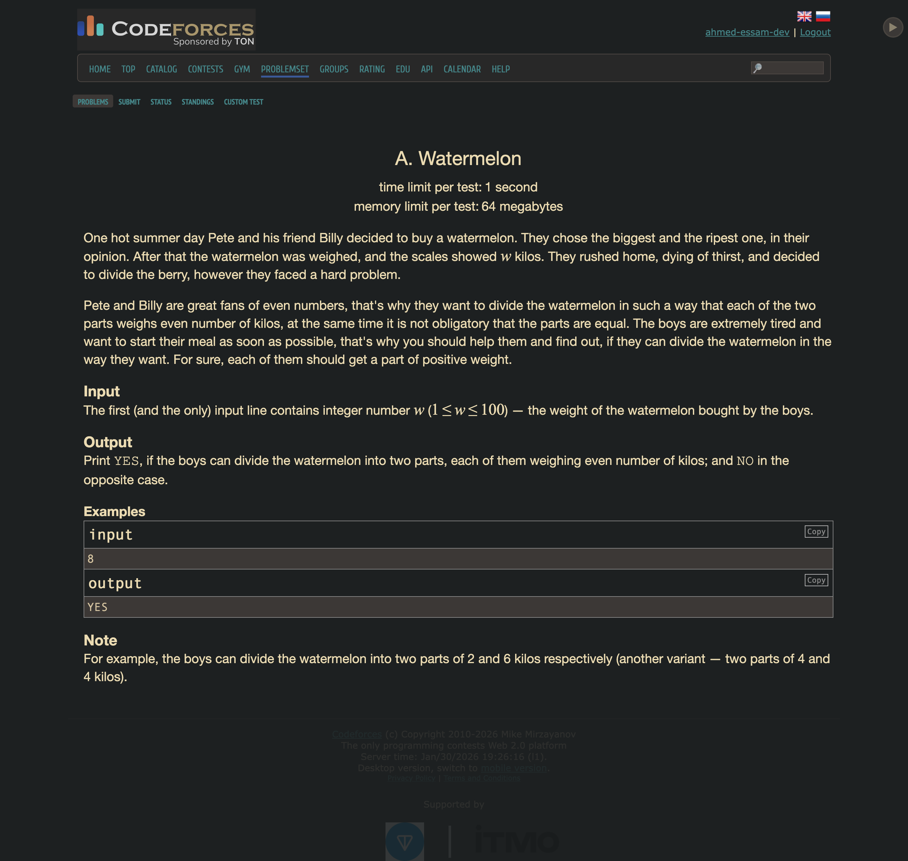
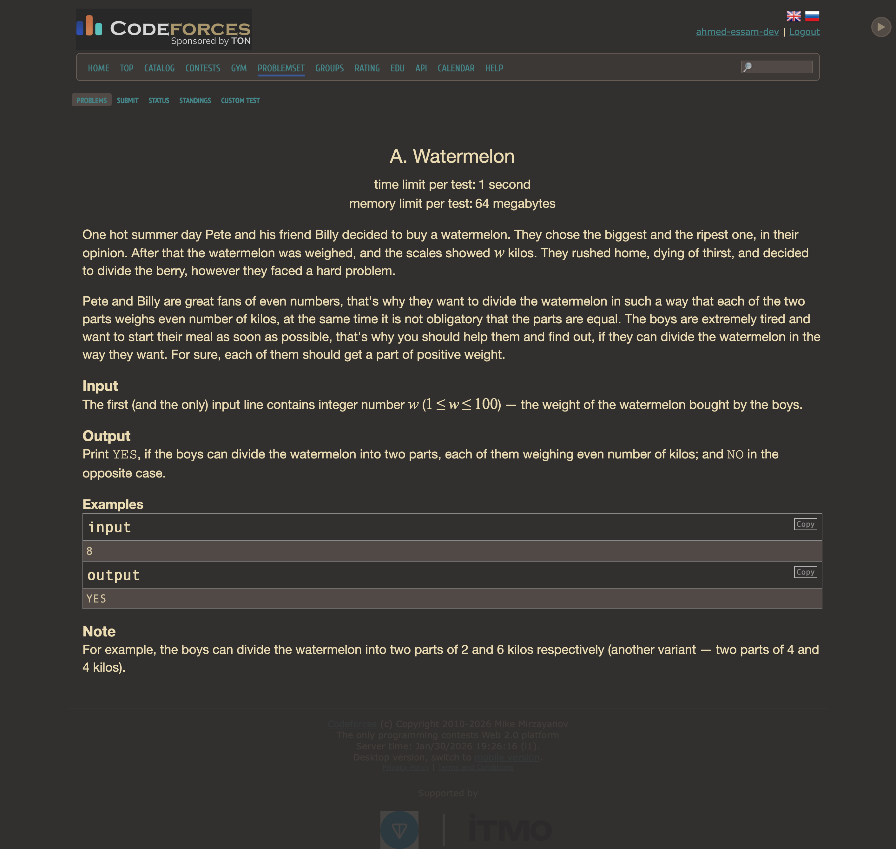
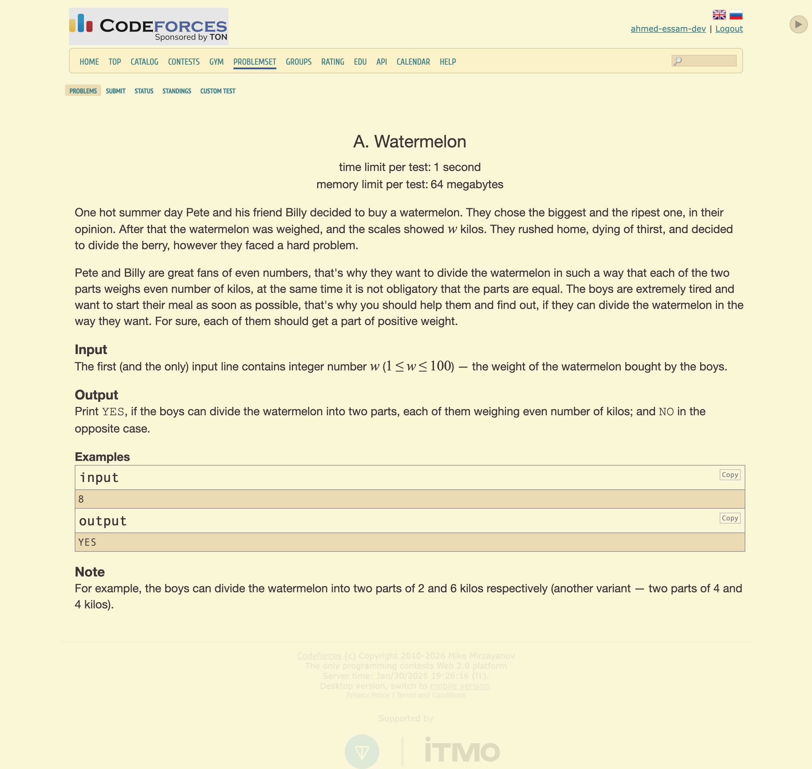
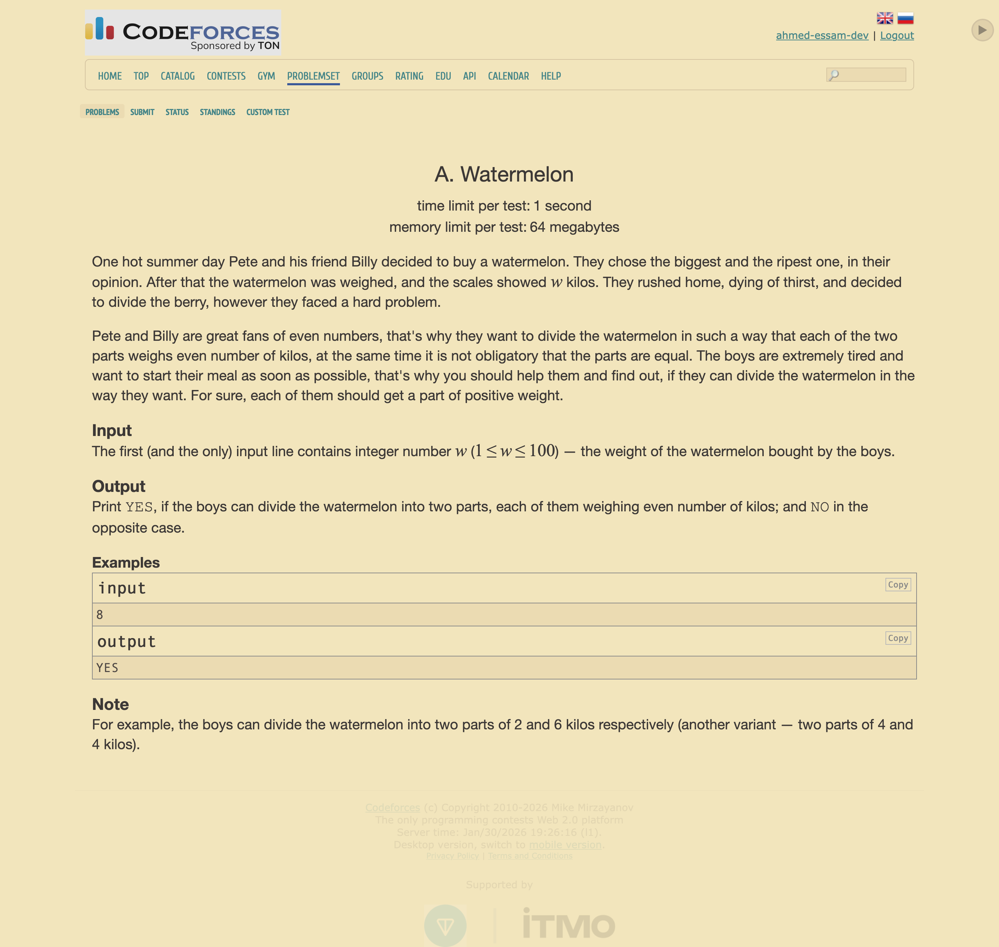
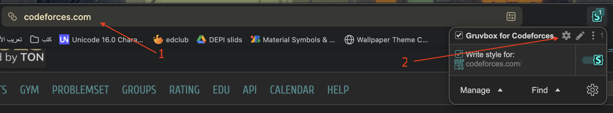
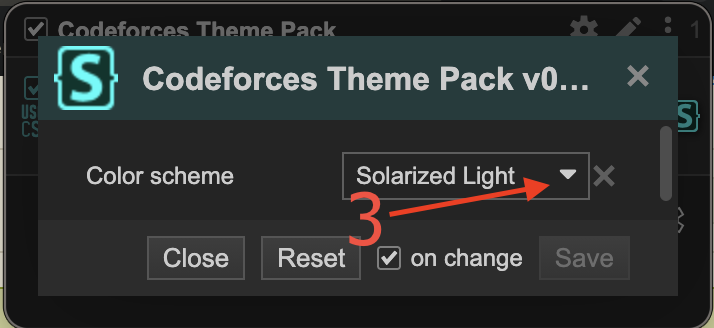

# Gruvbox theme for Codeforces

  

This is a [gruvbox](https://github.com/morhetz/gruvbox) theme for Codeforces with light/dark and soft/hard variants.

## Screenshots

 
    
    

 
    
    

## Install

To install this theme you should first have stylus extention installed on your browser.

If you dont have it, install **Stylus** for: [Firefox based browser](https://addons.mozilla.org/en-US/firefox/addon/styl-us/) - [Chromium based browser](https://chromewebstore.google.com/detail/stylus/clngdbkpkpeebahjckkjfobafhncgmne).

Then click [install](https://raw.githubusercontent.com/ahmed-essam-dev/gruvbox4codeforces/refs/heads/main/stylus.user.css).

## Change to other variant

To change the mode (light/dark) and the contrast (soft/hard):

 
    
    

1. you should first open the Codeforces website
2. then in the stylus options click the gear icon for the *"Gruvbox for Codeforces"* theme
3. now you can choose the variant you want from the dropdown menu

## 🔐 License

This project is licensed under the **MIT License**.

See the [LICENSE](./LICENSE) file for details.

## ⭐ Support

Star ⭐ the repo to support development!

Feedback & PRs are welcome!
